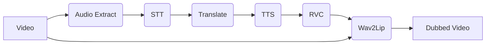

# AI 기반 다국어 음성 합성 및 실시간 립싱크 더빙 시스템 개발일지

## 📋 오늘의 작업 내용

### 1. 데모 시나리오 기획

- **주제**: "한국어 유튜브 영상을 1분 만에 글로벌 콘텐츠로 변환"
- **영상**: 30초 분량의 제품 리뷰 영상 (화자 얼굴 정면).
- **과정**: 업로드 -> 영어 선택 -> 더빙 실행 -> 결과 비교(Before/After).

### 2. 기술 문서 업데이트

- `README.md`: 설치 및 실행 방법 최신화.
- `docs/API.md`: API 엔드포인트 설명 추가.
- 아키텍처 다이어그램(Mermaid) 추가.

## 🔧 기술적 진행사항

### Mermaid Diagram



## 📊 진행 상황

| 항목 | 계획 | 실제 | 상태 |
|------|------|------|------|
| 시나리오 기획 | 완료 | 완료 | ✅ |
| 문서 업데이트 | 완료 | 완료 | ✅ |

## 🚧 이슈 사항 및 해결 방안

- **시연 효과**: 립싱크 효과가 작은 화면에서는 잘 안 보임. -> 결과 화면에서 확대(Zoom) 기능이나 비교(Side-by-Side) 뷰 제공 필요.

## 📝 내일 계획

1. 베타 테스트 계획 수립
2. 6월 성과 정리 준비

---

## 📚 참고 자료

- [1] "Mermaid Live Editor". [Link](https://mermaid.live/)

<details>
<summary>IRIS 붙여넣기용 HTML 코드</summary>

```html
<h3>1. 데모 시나리오 기획</h3>
<ul>
<li><strong>주제</strong>: "한국어 유튜브 영상을 1분 만에 글로벌 콘텐츠로 변환"</li>
<li><strong>영상</strong>: 30초 분량의 제품 리뷰 영상 (화자 얼굴 정면).</li>
<li><strong>과정</strong>: 업로드 -&gt; 영어 선택 -&gt; 더빙 실행 -&gt; 결과 비교(Before/After).</li>
</ul>
<h3>2. 기술 문서 업데이트</h3>
<ul>
<li><code>README.md</code>: 설치 및 실행 방법 최신화.</li>
<li><code>docs/API.md</code>: API 엔드포인트 설명 추가.</li>
<li>아키텍처 다이어그램(Mermaid) 추가.</li>
</ul>
```

</details>
